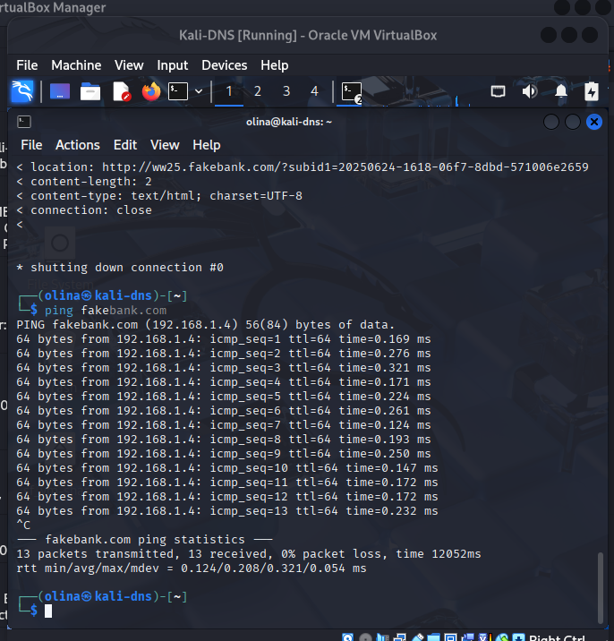
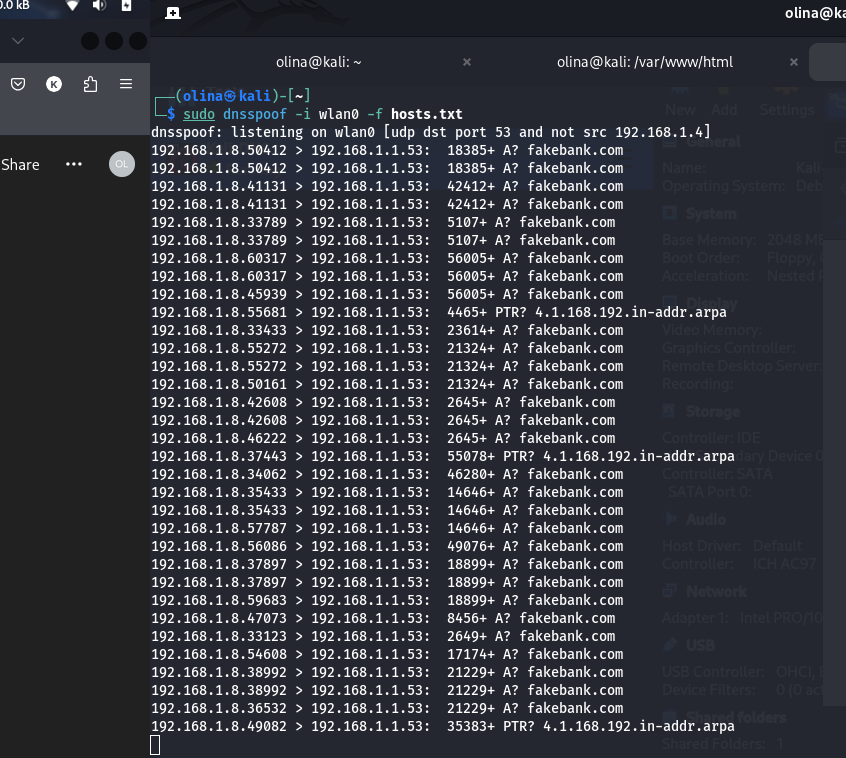
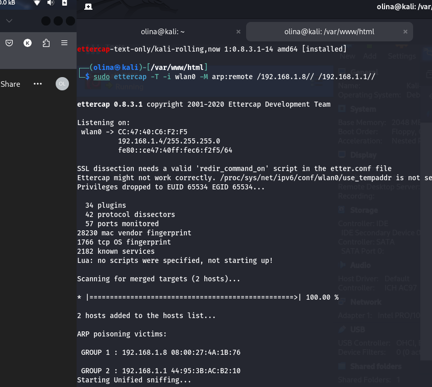
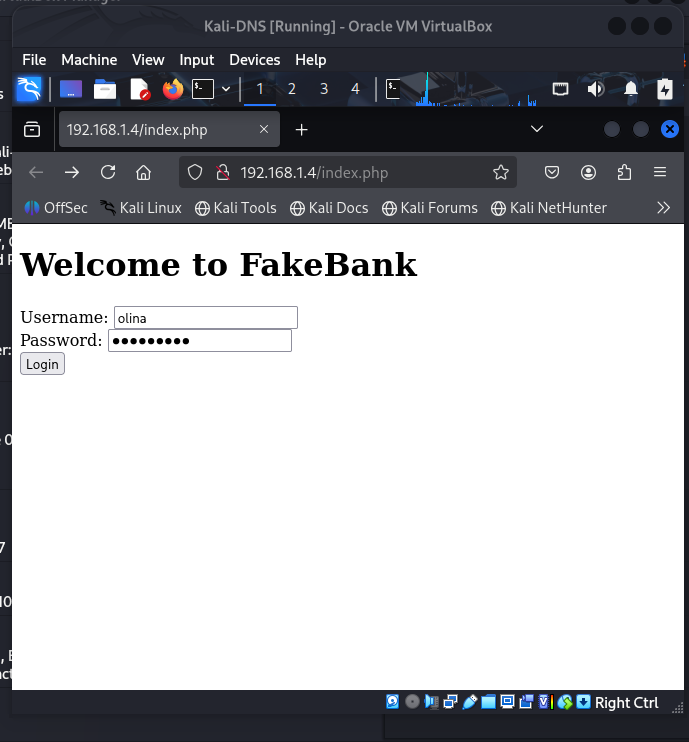

# DNS Spoofing & Credential Harvesting Lab

This project demonstrates a **DNS Spoofing attack** combined with **ARP poisoning** to redirect a victim to a fake banking site and harvest login credentials. The lab was conducted in a controlled environment using Kali Linux on VirtualBox.

## Lab Setup

- **Host**: Kali Linux (Attacker)
- **Victim**: Another Kali Linux VM
- **Network**: Bridged Adapter (same subnet)
- **Spoofed Domain**: `fakebank.com`
- **Spoofed IP**: `192.168.1.4` (attacker)
- **Tools Used**:
  - `ettercap` for ARP poisoning
  - `dnsspoof` for DNS spoofing
  - Apache2 web server with a fake login page

---

## 📷 Screenshots

### 1. Victim resolves `fakebank.com` to attacker IP


---

### 2. DNS queries spoofed with `dnsspoof`


---

### 3. ARP poisoning initiated with `ettercap`


---

### 4. Victim lands on fake login page


---

### 5. Redirects to Facebook after login submission


---

### 6. Attacker reads captured credentials

[view in the screenshots folder if not viewable]

---

## Captured Credentials (creds.txt)
```
Username: olina
Password: heheh1212
```

---

## Disclaimer

This project is intended for **educational purposes only**. Performing these techniques on unauthorized systems is illegal and unethical.

---

## Status

✔️ Project Completed  
📁 Folder: `dns-spoofing-lab`  
